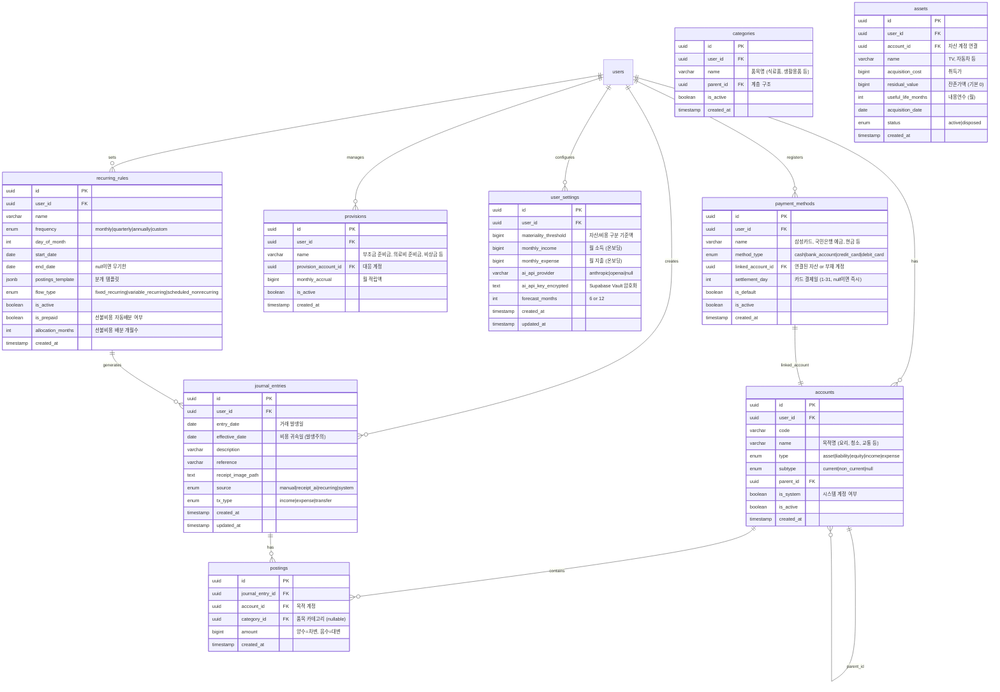

# feat: Accrual Accounting Household Book MVP

## Overview

"다음 달이 아니라 6개월 후를 보여주는 가계부" — 발생주의 회계와 내부 복식부기를 적용한 개인 재무 관리 앱.

기존 가계부의 근본적 한계(예측 가능한 것조차 예측 가능하게 보여주지 못함)를 해결하기 위해, 기업회계의 핵심 원리를 가계부에 맞게 재정의하여 적용한다. (see brainstorm: docs/brainstorms/2026-03-27-account-book-brainstorm.md)

## Problem Statement

1. **소비처 기준 분류, 목적 부재**: 동일 소비처에서의 다목적 지출 구분 불가
2. **현금주의 회계**: 월별 수입/지출 왜곡 (연간 보험료를 한 달에 전액 반영)
3. **미래 현금흐름 반영 불가**: 예정된 수입/지출을 미래 계획에 반영할 수단 없음
4. **불확실한 지출 대비 부재**: 부조금, 긴급 수리비 등에 대한 준비 장치 없음

## Proposed Solution

7개 핵심 개념을 구현한 웹 앱 (see brainstorm Part 1):

1. **가계부용 5대 계정 재정의**: 자산(환금성 기준) / 부채 / 순자산(자동) / 수입 / 지출
2. **발생주의 회계**: 월 단위 회계 기간, 선불비용 배분, 카드미결제, 감가상각
3. **내부 복식부기**: 사용자에게는 단순 폼, 내부는 차변/대변 자동 생성
4. **현금흐름 예측**: 4유형 분류 (고정반복/변동반복/예정비반복/불확실) + EMA 예측
5. **준비금 계정**: 가상 적립, 보수적 예측 반영
6. **3대 보고서**: 월간 손익 / 재산 현황 / 현금흐름표
7. **목적별 계정 분류**: 계정(상위)=목적, 카테고리(하위)=품목. 기업회계의 성격별 분류 대신 목적별 분류 채택 — 예측 안정성과 의사결정 단위 일치를 위해

## Technical Approach

### Architecture

```
┌─────────────────────────────────────────────────┐
│                    Next.js 16                     │
│                  App Router (RSC)                 │
├─────────────┬───────────────┬───────────────────┤
│   Pages     │   API Routes  │   proxy.ts        │
│  (app/)     │  (app/api/)   │  (auth guard)     │
├─────────────┴───────────────┴───────────────────┤
│              Client Libraries                     │
│  lib/supabase/ (client.ts / server.ts)           │
│  lib/accounting/ (journal engine)                │
│  lib/forecast/  (EMA, projection)                │
├──────────────────────────────────────────────────┤
│                   Supabase                        │
│  PostgreSQL (RLS) │ Auth (Google) │ Storage      │
└──────────────────────────────────────────────────┘
```

**주요 기술 결정:**
- **Next.js 16**: `proxy.ts` 사용 (middleware.ts → proxy.ts breaking change)
- **Supabase SSR**: `@supabase/ssr` 패키지, `getClaims()` 사용
- **복식부기 스키마**: 부호 기반 단일 amount 컬럼 (`+` = 차변, `-` = 대변)
- **차트**: Recharts (SVG, React 친화적, 가계부 규모에 최적)
- **금액 처리**: KRW 정수 기반, DB는 `bigint`, 앱은 `number`
- **Tailwind v4**: CSS `@theme` 기반 설정, 시스템 다크모드 기본

### Database Schema (ERD)



### 거래 유형별 복식부기 변환 규칙

```
[지출] 삼성카드로 쿠팡 35,000원 (요리용 재료 + 요리용 칼 + 청소용 세제):
  Dr. 요리(비용, 품목:식료품-채소)   +15,000
  Dr. 요리(비용, 품목:생활용품-칼)   +12,000
  Dr. 청소(비용, 품목:생활용품-세제)  +8,000
  Cr. 삼성카드미결제(부채)          -35,000
  → 계정(목적)이 "요리"와 "청소"로 분리됨. 같은 생활용품이라도 목적이 다르면 다른 계정.

[수입] 급여 300만원 국민은행 입금:
  Dr. 국민은행예금(자산)      +3,000,000
  Cr. 근로소득(수입)          -3,000,000

[이체] 국민은행 → 삼성카드 대금결제 50만원:
  Dr. 삼성카드미결제(부채)    +500,000
  Cr. 국민은행예금(자산)      -500,000

[이체] 국민은행 → 카카오뱅크 이체 100만원:
  Dr. 카카오뱅크예금(자산)    +1,000,000
  Cr. 국민은행예금(자산)      -1,000,000
```

### 결제 수단 → 계정 매핑

| 결제 수단 유형 | 연결 계정 유형 | 거래 시 동작 |
|--------------|-------------|------------|
| 현금 | 자산-현금 | 즉시 자산 감소 |
| 은행 예금 | 자산-예금 | 즉시 자산 감소 |
| 신용카드 | 부채-카드미결제 | 부채 증가, 결제일에 이체로 상환 |
| 체크카드 | 자산-예금 | 즉시 자산 감소 (연결 예금 계정) |

### Rounding 정책

감가상각, 선불비용 배분 등 나눗셈에서 정수로 떨어지지 않는 경우:
- 매월 `floor(총액 / 개월수)` 적용
- **마지막 월에 잔여액 일괄 조정** (업계 표준)
- 예: 100만원 / 36개월 = 매월 27,777원 × 35개월 + 마지막 월 27,805원

### Key SQL Functions

```sql
-- 분개 생성 (차대변 균형 검증 포함)
CREATE OR REPLACE FUNCTION create_journal_entry(
  p_user_id UUID,
  p_entry_date DATE,
  p_effective_date DATE,
  p_description TEXT,
  p_source TEXT,
  p_postings JSONB  -- [{account_id, amount}, ...]
) RETURNS UUID
LANGUAGE plpgsql SECURITY DEFINER AS $$
DECLARE
  v_journal_id UUID;
  v_total BIGINT;
BEGIN
  SELECT SUM((p->>'amount')::BIGINT) INTO v_total
  FROM jsonb_array_elements(p_postings) AS p;

  IF v_total != 0 THEN
    RAISE EXCEPTION 'Journal entry not balanced: total = %', v_total;
  END IF;

  INSERT INTO journal_entries (user_id, entry_date, effective_date, description, source)
  VALUES (p_user_id, p_entry_date, p_effective_date, p_description, p_source)
  RETURNING id INTO v_journal_id;

  INSERT INTO postings (journal_entry_id, account_id, amount)
  SELECT v_journal_id, (p->>'account_id')::UUID, (p->>'amount')::BIGINT
  FROM jsonb_array_elements(p_postings) AS p;

  RETURN v_journal_id;
END;
$$;

-- 계정 잔액 조회 (특정 날짜 기준)
CREATE OR REPLACE FUNCTION get_account_balance(
  p_account_id UUID,
  p_as_of DATE DEFAULT CURRENT_DATE
) RETURNS BIGINT
LANGUAGE sql STABLE AS $$
  SELECT COALESCE(SUM(p.amount), 0)
  FROM postings p
  JOIN journal_entries je ON p.journal_entry_id = je.id
  WHERE p.account_id = p_account_id
    AND je.effective_date <= p_as_of;
$$;
```

### Implementation Phases

#### Phase 1: Foundation (인증 + 기본 구조)

**목표**: 로그인하고 보호된 페이지에 접근할 수 있는 상태

- [ ] `npm install @supabase/supabase-js @supabase/ssr` 설치
- [ ] `lib/supabase/client.ts` — 브라우저용 Supabase 클라이언트
- [ ] `lib/supabase/server.ts` — 서버 컴포넌트/API Route용 클라이언트
- [ ] `proxy.ts` — 세션 리프레시 + 인증 가드 (Next.js 16 방식)
- [ ] `app/auth/callback/route.ts` — Google OAuth 콜백 핸들러
- [ ] `app/login/page.tsx` — Google 로그인 버튼
- [ ] `app/(protected)/layout.tsx` — 인증된 사용자만 접근 가능한 레이아웃
- [ ] `app/(protected)/dashboard/page.tsx` — 빈 대시보드 (placeholder)
- [ ] 반응형 앱 셸: 데스크톱 사이드바 + 모바일 바텀 네비게이션
- [ ] `globals.css` — Tailwind v4 `@theme` 커스텀 색상/간격 정의, 시스템 다크모드

**verify**: Google 로그인 → 대시보드 접근 가능, 비인증 시 로그인 페이지로 리다이렉트

#### Phase 2: Database + Accounting Engine (핵심 엔진)

**목표**: 복식부기 기반 거래 입력과 잔액 조회가 작동하는 상태

- [ ] Supabase SQL: `accounts` 테이블 + RLS 정책
- [ ] Supabase SQL: `categories` 테이블 + RLS 정책
- [ ] Supabase SQL: `payment_methods` 테이블 + RLS 정책
- [ ] Supabase SQL: `journal_entries` 테이블 + RLS 정책
- [ ] Supabase SQL: `postings` 테이블 + RLS 정책 (journal_entry 기반 간접 보호)
- [ ] Supabase SQL: `user_settings` 테이블 + RLS 정책
- [ ] Supabase SQL: `create_journal_entry()` RPC 함수 (차대변 균형 검증)
- [ ] Supabase SQL: `get_account_balance()` 함수
- [ ] Supabase SQL: 기본 계정과목 시드 함수 (`seed_default_accounts(user_id)`)
- [ ] `lib/accounting/journal.ts` — 분개 생성 로직 (사용자 입력 → 복식부기 변환)
- [ ] `lib/accounting/types.ts` — AccountType, JournalEntry, Posting 타입 정의
- [ ] `lib/accounting/templates.ts` — 기본 템플릿: 목적별 계정 (요리, 청소, 교통 등) + 품목별 카테고리 (식료품, 생활용품 등)

**verify**: Supabase MCP로 테이블 생성, RLS 테스트, 분개 생성 시 차대변 균형 검증

#### Phase 3: Transaction Input (거래 입력)

**목표**: 3가지 거래 유형(수입/지출/이체)을 입력하고 항목별 분리가 가능한 상태

- [ ] `app/(protected)/transactions/new/page.tsx` — 거래 입력 폼
  - **거래 유형 선택**: 지출 / 수입 / 이체 탭
  - **지출**: 날짜, 설명, 결제수단(드롭다운), 항목(품목명+금액+**목적 계정**+품목 카테고리) 동적 추가
  - **수입**: 날짜, 설명, 입금 계정(드롭다운), 수입 **목적 계정**, 금액
  - **이체**: 날짜, 설명, 출금 계정 → 입금 계정, 금액
  - 합계 실시간 표시 (분리 입력 시 top-down: 총액 입력 후 분배, 잔여액 자동 표시)
  - 자산 등록 유도: 기준액 초과 시 "자산으로 등록?" 토스트
- [ ] `app/(protected)/transactions/page.tsx` — 거래 목록
  - 기간별 / 카테고리별 / 거래유형별 / 금액 범위 필터
  - 텍스트 검색
  - 무한 스크롤 또는 페이지네이션
- [ ] `app/(protected)/transactions/[id]/page.tsx` — 거래 상세/수정/삭제
  - 삭제 시 관련 분개 cascade 삭제 + 사용자 확인
- [ ] `app/api/transactions/route.ts` — 거래 CRUD API (내부에서 복식부기 분개 자동 생성)
- [ ] `lib/accounting/journal.ts` — 거래유형별 분개 변환 엔진
  - 지출: `Dr. 비용계정(들) / Cr. 결제수단연결계정`
  - 수입: `Dr. 입금계정 / Cr. 수입계정`
  - 이체: `Dr. 입금계정 / Cr. 출금계정`

**verify**: 3가지 거래 유형 각각 입력 → 복식부기 분개 정확성, 목록 필터/검색 동작, 수정/삭제 cascade

#### Phase 4: Accrual Accounting Features (발생주의)

**목표**: 자산 등록/감가상각, 선불비용 배분, 카드 미결제 추적이 작동하는 상태

- [ ] `assets` 테이블 + RLS
- [ ] `app/(protected)/assets/page.tsx` — 자산 목록 (현재 가치 표시)
- [ ] `app/(protected)/assets/new/page.tsx` — 자산 등록 (취득가, 잔존가액, 내용연수)
- [ ] `lib/accounting/depreciation.ts` — 정액법 감가상각 계산 ((취득가 - 잔존가액) / 내용연수)
- [ ] `lib/accounting/accrual.ts` — 선불비용 월할 배분 로직
- [ ] `app/api/cron/monthly-close/route.ts` — 월말 자동 처리 (실제로는 조회 시 실시간 계산)
  - 감가상각비 분개 생성
  - 선불비용 소멸 분개 생성
  - 준비금 적립 분개 생성

**핵심 결정**: 실시간 계산 방식 (see brainstorm). 마감 개념 없이, 조회 시점에 해당 월까지의 감가상각/선불비용 소멸을 계산. 과거 데이터 자유 수정 허용 → 수정된 월 이후 모든 월 cascade 재계산.

**카드 결제 사이클**:
1. 카드 사용 시: `Dr. 비용 / Cr. 카드미결제(부채)` — 자동
2. 카드 대금 결제: 사용자가 "이체" 거래로 입력 (`Dr. 카드미결제 / Cr. 예금`) — 수동 또는 반복거래 등록

**자산 처분**:
- 자산 상태를 "disposed"로 변경
- 잔여 장부가액을 일시 비용 처리 (자동 분개)
- 매각 시 매각가와 장부가 차이를 처분손익으로 기록

**감가상각 월 중 등록**: 등록 월은 전액 상각 (일할 계산하지 않음, 단순화)

**verify**: 자산 등록 → 월별 감가상각비 반영 확인, 선불비용 12개월 배분 확인, 자산 처분 → 잔여 장부가 비용 처리 확인

#### Phase 5: Recurring & Provisions (반복거래 + 준비금)

**목표**: 반복 거래 자동 생성과 준비금 계정이 작동하는 상태

- [ ] `recurring_rules` 테이블 + RLS
- [ ] `provisions` 테이블 + RLS
- [ ] `app/(protected)/recurring/page.tsx` — 반복/예정 거래 목록
- [ ] `app/(protected)/recurring/new/page.tsx` — 반복 거래 등록 (고정반복/예정비반복)
  - 선불비용 체크 시 배분 개월수 입력
- [ ] `app/(protected)/provisions/page.tsx` — 준비금 관리
- [ ] `app/(protected)/provisions/new/page.tsx` — 준비금 생성 (목적별/통합)
- [ ] `lib/accounting/recurring.ts` — 반복 거래 생성 엔진
- [ ] `lib/accounting/provisions.ts` — 준비금 적립/차감 로직

**verify**: 월세 등록 → 매월 자동 분개, 준비금 적립 → 예측에 지출로 반영

#### Phase 6: Cash Flow Forecasting + Dashboard (예측 + 대시보드)

**목표**: 메인 화면에서 이번 달 요약과 미래 예측 그래프를 볼 수 있는 상태

- [ ] `npm install recharts`
- [ ] `lib/forecast/ema.ts` — 지수가중이동평균 (EMA) 계산
- [ ] `lib/forecast/outlier.ts` — IQR 기반 이상치 제거
- [ ] `lib/forecast/projection.ts` — 현금흐름 예측 엔진
  - 고정 반복: recurring_rules에서 미래 일정 생성
  - 변동 반복: 과거 데이터 EMA → 미래 N개월 예측
  - 예정 비반복: recurring_rules에서 단발 일정
  - 불확실 발생: provisions 월 적립액을 지출로 반영
  - 수입도 동일 체계 적용 (급여, 이자 등)
- [ ] `app/(protected)/dashboard/page.tsx` — 대시보드 구현
  - 이번 달 요약 카드: 수입, 비용(발생주의), 순저축
  - 미래 예측 그래프 (AreaChart, 6/12개월 토글)
  - 순자산 추이 그래프 (LineChart)
- [ ] `app/components/charts/CashFlowChart.tsx` — 예측 차트 컴포넌트
- [ ] `app/components/charts/NetWorthChart.tsx` — 순자산 추이 차트

**verify**: 대시보드에서 이번 달 요약 + 6개월 예측 그래프 + 순자산 추이 확인

#### Phase 7: Reports (보고서)

**목표**: 3대 보고서를 월 단위로 조회할 수 있는 상태

- [ ] `app/(protected)/reports/page.tsx` — 보고서 허브
- [ ] `app/(protected)/reports/income-statement/page.tsx` — 월간 손익 (P&L)
  - 카테고리별 수입/비용 내역
  - 순저축/순소비 합계
- [ ] `app/(protected)/reports/balance-sheet/page.tsx` — 재산 현황 (B/S)
  - 유동자산 / 비유동자산 분리
  - 부채 목록
  - 순자산
- [ ] `app/(protected)/reports/cash-flow/page.tsx` — 현금흐름표 (C/F)
  - 실제 현금 유입/유출 (현금주의 기준)
- [ ] `lib/reports/income-statement.ts` — P&L 계산 로직
- [ ] `lib/reports/balance-sheet.ts` — B/S 계산 로직
- [ ] `lib/reports/cash-flow-statement.ts` — C/F 계산 로직

**verify**: 각 보고서에서 월 선택 → 정확한 데이터 표시, 회계등식(자산=부채+순자산) 성립 확인

#### Phase 8: AI Receipt Parsing (영수증 인식)

**목표**: 영수증 사진을 업로드하면 AI가 항목을 파싱하여 입력 폼을 자동 채우는 상태

- [ ] Supabase Storage: `receipts` 버킷 생성 (private) + RLS
- [ ] `app/api/receipts/parse/route.ts` — 영수증 파싱 API
  - 사용자의 AI API 키를 서버사이드에서 사용 (NEXT_PUBLIC_ 아님)
  - 멀티모달 LLM에 이미지 + 프롬프트 전송
  - Structured output으로 항목/금액/카테고리 추출
- [ ] `app/api/receipts/upload/route.ts` — 이미지 업로드 (Supabase Storage)
- [ ] 거래 입력 폼에 이미지 업로드 버튼 추가
  - 업로드 → 파싱 → 결과를 폼에 자동 채움 → 사용자 확인/수정 → 저장
- [ ] `lib/ai/receipt-parser.ts` — LLM 호출 + 응답 파싱 로직

**verify**: 영수증 사진 업로드 → AI 파싱 → 항목 자동 채움 → 수정 후 저장

#### Phase 9: Onboarding + Settings + Export (마무리)

**목표**: 신규 사용자 온보딩, 설정 관리, 데이터 내보내기가 완성된 상태

- [ ] `app/(protected)/onboarding/page.tsx` — 온보딩 플로우
  - Step 1: 월 소득/지출 범위 입력
  - Step 2: 결제 수단 등록 (현금, 은행 예금, 신용카드 등 — 최소 1개 필수)
  - Step 3: 기본 카테고리 확인/커스터마이징
  - Step 4: AI API 키 입력 (선택)
  - 완료 → 기본 계정과목 시드 + 결제수단별 자산/부채 계정 자동 생성 + user_settings 생성
  - 온보딩 미완료 시 다음 로그인에서 이어서 진행
- [ ] `app/(protected)/settings/page.tsx` — 설정 페이지
  - 자산/비용 구분 기준액 조정
  - AI API 키 관리 (추가/변경/삭제)
  - 예측 기간 설정 (6/12개월)
- [ ] `app/(protected)/categories/page.tsx` — 계정(목적) + 품목(카테고리) 관리
  - 계정 관리: 목적별 비용/수입 계정 (요리, 청소, 교통, 주거 등)
  - 카테고리 관리: 품목 분류 (식료품, 생활용품, 전자제품 등) — 계층 구조
  - 추가/수정/삭제
- [ ] `app/api/export/csv/route.ts` — CSV 내보내기 API
- [ ] `app/(protected)/export/page.tsx` — 데이터 내보내기 페이지

**verify**: 신규 가입 → 온보딩 완료 → 기본 카테고리 생성 확인, CSV 다운로드 작동

## System-Wide Impact

### Interaction Graph

거래 입력 → `create_journal_entry()` RPC → postings 생성 → 계정 잔액 변경 → 대시보드 요약/예측 재계산 → 보고서 데이터 변경.

반복 거래 규칙 변경 → 미래 예측 재계산.
준비금 설정 변경 → 예측 그래프의 지출 예측 변경.
자산 등록/수정 → 감가상각 스케줄 변경 → 월별 비용 변경 → P&L 변경.

### Error Propagation

- DB 레벨: `create_journal_entry()`에서 차대변 불균형 시 RAISE EXCEPTION → API Route에서 400 응답
- Auth: proxy.ts에서 세션 만료 → 로그인 페이지로 리다이렉트
- AI 파싱: API 키 무효/할당량 초과 → 사용자에게 에러 표시, 수동 입력으로 fallback
- Storage: 이미지 업로드 실패 → 재시도 UI

### State Lifecycle Risks

- **분개의 원자성**: journal_entry + postings는 반드시 한 트랜잭션에서 생성. RPC 함수로 보장.
- **과거 수정**: 과거 거래 수정 시 관련 분개 전체를 역분개(reversal) + 재생성. 부분 수정 불허.
- **준비금 잔액**: provision의 current_balance는 postings에서 실시간 계산하는 게 안전 (캐시 불일치 방지).

### API Surface Parity

- 모든 거래 CRUD: `app/api/transactions/` API Route
- 보고서: 서버 컴포넌트에서 직접 Supabase 쿼리 (API Route 불필요)
- AI 파싱: `app/api/receipts/parse/` (사용자 API 키 보호를 위해 서버사이드 필수)

## Acceptance Criteria

### Functional Requirements

- [ ] Google 로그인으로 가입/로그인 가능
- [ ] 온보딩 완료 시 기본 카테고리 + 설정 생성
- [ ] 수동 거래 입력 (항목별 분리 가능)
- [ ] 영수증 이미지 → AI 파싱 → 자동 채움 → 확인 후 저장
- [ ] 기준액 이상 구매 시 자산 등록 제안
- [ ] 자산 감가상각 (정액법) 월별 자동 계산
- [ ] 선불비용 월할 배분 자동 처리
- [ ] 카드 미결제 부채 추적
- [ ] 반복 거래 등록 및 자동 생성
- [ ] 준비금 계정 생성/적립/차감
- [ ] 대시보드: 이번 달 요약 (발생주의 비용) + 예측 그래프 + 순자산 추이
- [ ] 예측 그래프 6/12개월 전환
- [ ] 3대 보고서 (P&L, B/S, C/F) 월별 조회
- [ ] 결제 수단 등록 및 관리
- [ ] 이체 거래 (카드 대금 결제, 계좌 이체) 입력 가능
- [ ] 목적별 계정 분류 + 품목별 카테고리 동작
- [ ] 계정/카테고리 CRUD
- [ ] CSV 내보내기
- [ ] 과거 데이터 자유 수정 → 해당 월 자동 재계산
- [ ] 모든 분개에서 차변합 = 대변합 (회계등식 불변)

### Non-Functional Requirements

- [ ] 반응형: 모바일 (375px~) / 태블릿 / 데스크톱
- [ ] 시스템 다크/라이트 모드 자동 전환
- [ ] 회계 용어 그대로 사용 (자산, 부채, 감가상각 등)
- [ ] 모든 테이블 RLS 활성화
- [ ] service_role 키 프론트엔드 노출 없음
- [ ] AI API 키 서버사이드에서만 사용

## Dependencies & Prerequisites

- Supabase 프로젝트: `noxluymptcnigcimliby` (생성 완료)
- Google OAuth: Supabase Dashboard에서 Google provider 설정 필요
- Supabase Storage: `receipts` 버킷 생성 필요
- 패키지 설치: `@supabase/supabase-js`, `@supabase/ssr`, `recharts`

## Risk Analysis & Mitigation

| Risk | Impact | Mitigation |
|------|--------|------------|
| Next.js 16 breaking changes | 높음 | `node_modules/next/dist/docs/` 참조, proxy.ts 사용 |
| 복식부기 로직 복잡도 | 높음 | 사용자 입력 → 분개 변환을 템플릿화, RPC 함수로 정합성 보장 |
| AI 파싱 정확도 | 중간 | 항상 사용자 확인/수정 단계 포함, fallback으로 수동 입력 |
| EMA 예측 정확도 초기 데이터 부족 | 중간 | 데이터 3개월 미만 시 단순 평균, 이후 EMA 전환 |
| Supabase 무료 티어 제한 | 낮음 | 개인 사용 규모에서는 충분 (500MB DB, 1GB Storage) |

## File Structure

```
account-book/
├── app/
│   ├── (protected)/
│   │   ├── layout.tsx              # 인증 필수 레이아웃
│   │   ├── dashboard/page.tsx      # 메인 대시보드
│   │   ├── transactions/
│   │   │   ├── page.tsx            # 거래 목록
│   │   │   ├── new/page.tsx        # 거래 입력
│   │   │   └── [id]/page.tsx       # 거래 상세/수정
│   │   ├── assets/
│   │   │   ├── page.tsx            # 자산 목록
│   │   │   └── new/page.tsx        # 자산 등록
│   │   ├── recurring/
│   │   │   ├── page.tsx            # 반복 거래 목록
│   │   │   └── new/page.tsx        # 반복 거래 등록
│   │   ├── provisions/
│   │   │   ├── page.tsx            # 준비금 관리
│   │   │   └── new/page.tsx        # 준비금 생성
│   │   ├── reports/
│   │   │   ├── page.tsx            # 보고서 허브
│   │   │   ├── income-statement/page.tsx
│   │   │   ├── balance-sheet/page.tsx
│   │   │   └── cash-flow/page.tsx
│   │   ├── categories/page.tsx     # 카테고리 관리
│   │   ├── payment-methods/
│   │   │   ├── page.tsx            # 결제 수단 목록
│   │   │   └── new/page.tsx        # 결제 수단 등록
│   │   ├── settings/page.tsx       # 설정
│   │   ├── export/page.tsx         # 데이터 내보내기
│   │   └── onboarding/page.tsx     # 온보딩
│   ├── auth/
│   │   └── callback/route.ts       # OAuth 콜백
│   ├── login/page.tsx              # 로그인 페이지
│   ├── api/
│   │   ├── transactions/route.ts
│   │   ├── receipts/
│   │   │   ├── parse/route.ts      # AI 영수증 파싱
│   │   │   └── upload/route.ts     # 이미지 업로드
│   │   └── export/csv/route.ts
│   ├── components/
│   │   ├── charts/
│   │   │   ├── CashFlowChart.tsx
│   │   │   └── NetWorthChart.tsx
│   │   ├── layout/
│   │   │   ├── Sidebar.tsx
│   │   │   ├── BottomNav.tsx
│   │   │   └── AppShell.tsx
│   │   └── ui/                     # 공통 UI 컴포넌트
│   ├── globals.css
│   ├── layout.tsx
│   └── page.tsx                    # 랜딩 → 로그인 리다이렉트
├── lib/
│   ├── supabase/
│   │   ├── client.ts               # 브라우저용
│   │   └── server.ts               # 서버용
│   ├── accounting/
│   │   ├── types.ts                # 타입 정의
│   │   ├── journal.ts              # 분개 생성 엔진
│   │   ├── templates.ts            # 기본 카테고리 템플릿
│   │   ├── depreciation.ts         # 감가상각
│   │   ├── accrual.ts              # 선불비용 배분
│   │   ├── recurring.ts            # 반복 거래
│   │   └── provisions.ts           # 준비금
│   ├── forecast/
│   │   ├── ema.ts                  # EMA 계산
│   │   ├── outlier.ts              # 이상치 제거
│   │   └── projection.ts           # 현금흐름 예측 엔진
│   ├── reports/
│   │   ├── income-statement.ts
│   │   ├── balance-sheet.ts
│   │   └── cash-flow-statement.ts
│   ├── ai/
│   │   └── receipt-parser.ts       # LLM 영수증 파싱
│   └── utils/
│       └── currency.ts             # KRW 포맷팅
├── proxy.ts                        # Next.js 16 인증 미들웨어
├── CLAUDE.md
└── docs/
    ├── brainstorms/
    └── plans/
```

## Sources & References

### Origin

- **Brainstorm document:** [docs/brainstorms/2026-03-27-account-book-brainstorm.md](docs/brainstorms/2026-03-27-account-book-brainstorm.md)
  - Key decisions: 5대 계정 재정의, 발생주의+내부복식부기, EMA+이상치제거 예측, 가상적립 준비금, 보수적 예측

### External References

- [Double-entry bookkeeping for PostgreSQL](https://gist.github.com/NYKevin/9433376)
- [Supabase SSR with Next.js](https://supabase.com/docs/guides/auth/server-side/nextjs)
- [Supabase RLS Best Practices](https://supabase.com/docs/guides/database/postgres/row-level-security)
- [Recharts Documentation](https://recharts.org/en-US/)
- [Claude Structured Outputs](https://platform.claude.com/docs/en/build-with-claude/structured-outputs)
- Next.js 16 공식 문서: `node_modules/next/dist/docs/` (proxy.ts 등 breaking changes)
